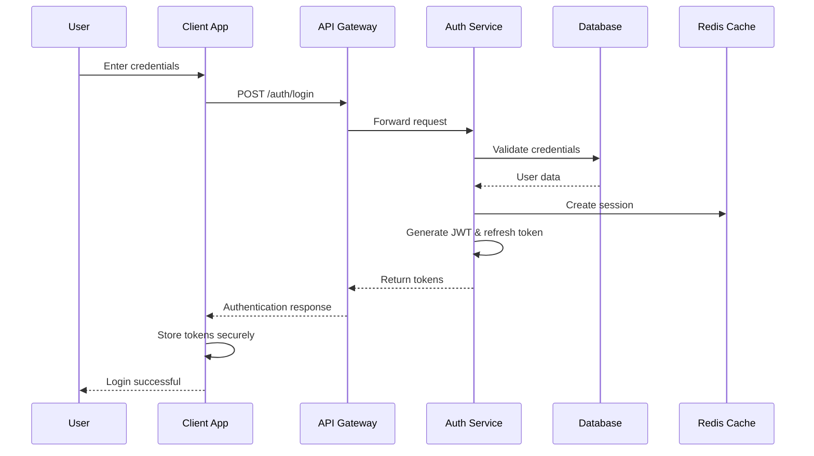
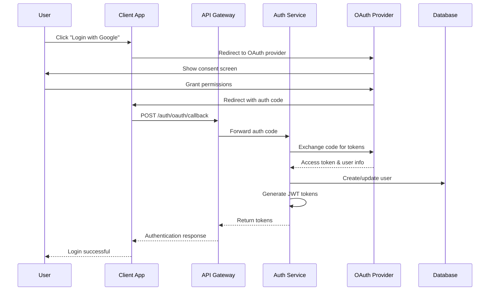
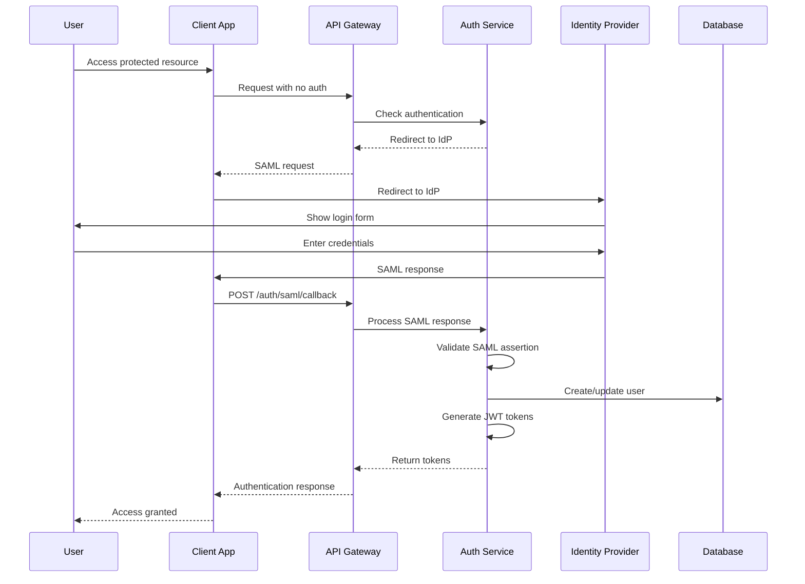

# Authentication & Authorization Flow Design
## Swarm Coordination Mastery Learning Platform

### Authentication Architecture Overview

The platform implements a multi-layered authentication and authorization system designed for enterprise-grade security while maintaining excellent user experience.

### Core Authentication Components

#### 1. Identity Providers (IdP) Integration
```
┌─────────────────────────────────────────────────────────────────┐
│                 Identity Provider Layer                         │
├─────────────────────────────────────────────────────────────────┤
│ Internal Auth    │ Social Auth      │ Enterprise SSO            │
│ - Email/Password │ - Google OAuth   │ - SAML 2.0               │
│ - Username/Pass  │ - GitHub OAuth   │ - OIDC                   │
│ - MFA Support    │ - LinkedIn OAuth │ - Active Directory       │
│ - Password Reset │ - Microsoft OAuth│ - Okta, Auth0            │
└─────────────────────────────────────────────────────────────────┘
```

#### 2. Token Management System
```
┌─────────────────────────────────────────────────────────────────┐
│                   Token Management                              │
├─────────────────────────────────────────────────────────────────┤
│ JWT Access Token │ Refresh Token    │ Session Token             │
│ - 1 hour expiry  │ - 30 day expiry  │ - 24 hour expiry         │
│ - User claims    │ - Rotation       │ - Device binding          │
│ - Role/Permissions│ - Secure storage │ - IP validation          │
│ - Stateless      │ - Revocation     │ - Activity tracking       │
└─────────────────────────────────────────────────────────────────┘
```

### Authentication Flow Diagrams

#### Standard Email/Password Authentication


#### Social OAuth Authentication


#### Enterprise SSO (SAML) Authentication


### Role-Based Access Control (RBAC)

#### Role Hierarchy
```
┌─────────────────────────────────────────────────────────────────┐
│                      Role Hierarchy                             │
├─────────────────────────────────────────────────────────────────┤
│ Super Admin                                                     │
│ ├── System Administration                                       │
│ ├── User Management                                             │
│ ├── Content Management                                          │
│ └── Analytics & Reporting                                       │
│                                                                 │
│ Platform Admin                                                  │
│ ├── Content Management                                          │
│ ├── User Support                                                │
│ └── Course Analytics                                            │
│                                                                 │
│ Instructor                                                      │
│ ├── Course Creation                                             │
│ ├── Student Progress                                            │
│ └── Assessment Grading                                          │
│                                                                 │
│ Student                                                         │
│ ├── Course Access                                               │
│ ├── Progress Tracking                                           │
│ └── Certificate Generation                                      │
│                                                                 │
│ Guest                                                           │
│ ├── Course Browsing                                             │
│ └── Public Content                                              │
└─────────────────────────────────────────────────────────────────┘
```

#### Permission Matrix
```yaml
Permissions:
  # User Management
  users:
    read: [super_admin, platform_admin, instructor]
    write: [super_admin, platform_admin]
    delete: [super_admin]
    
  # Content Management
  courses:
    read: [super_admin, platform_admin, instructor, student, guest]
    write: [super_admin, platform_admin, instructor]
    delete: [super_admin, platform_admin]
    publish: [super_admin, platform_admin]
    
  modules:
    read: [super_admin, platform_admin, instructor, student]
    write: [super_admin, platform_admin, instructor]
    delete: [super_admin, platform_admin, instructor]
    
  assessments:
    read: [super_admin, platform_admin, instructor, student]
    write: [super_admin, platform_admin, instructor]
    delete: [super_admin, platform_admin, instructor]
    grade: [super_admin, platform_admin, instructor]
    
  # Progress & Analytics
  progress:
    read_own: [student, instructor]
    read_all: [super_admin, platform_admin, instructor]
    write_own: [student]
    write_all: [super_admin, platform_admin]
    
  analytics:
    read: [super_admin, platform_admin, instructor]
    export: [super_admin, platform_admin]
    
  # System Operations
  system:
    admin: [super_admin]
    monitor: [super_admin, platform_admin]
    backup: [super_admin]
    
  # Swarm Operations
  swarm:
    create: [super_admin, platform_admin, instructor, student]
    manage: [super_admin, platform_admin, instructor]
    execute: [super_admin, platform_admin, instructor, student]
    admin: [super_admin, platform_admin]
```

### Content Gating & Progressive Access

#### Gating Rules Engine
```javascript
// Example gating rules configuration
const gatingRules = {
  courses: {
    // Beginner level - open access after enrollment
    beginner: {
      requirements: ["enrollment"],
      unlockConditions: []
    },
    
    // Intermediate level - requires beginner completion
    intermediate: {
      requirements: ["enrollment"],
      unlockConditions: [
        {
          type: "level_completion",
          level: "beginner",
          minScore: 70
        }
      ]
    },
    
    // Advanced level - requires intermediate completion
    advanced: {
      requirements: ["enrollment"],
      unlockConditions: [
        {
          type: "level_completion",
          level: "intermediate",
          minScore: 80
        }
      ]
    }
  },
  
  modules: {
    // Sequential module unlocking
    sequential: {
      requirements: ["course_enrollment"],
      unlockConditions: [
        {
          type: "previous_module_completion",
          minScore: 60
        }
      ]
    },
    
    // Assessment-gated modules
    assessment_gated: {
      requirements: ["course_enrollment"],
      unlockConditions: [
        {
          type: "assessment_completion",
          assessmentType: "quiz",
          minScore: 70
        }
      ]
    }
  }
};
```

#### Access Control Implementation
```javascript
// Access control middleware
const checkAccess = async (req, res, next) => {
  const { user, resource, action } = req;
  
  try {
    // 1. Check authentication
    if (!user) {
      return res.status(401).json({ error: "Authentication required" });
    }
    
    // 2. Check role permissions
    const hasPermission = await checkRolePermissions(user.roles, resource, action);
    if (!hasPermission) {
      return res.status(403).json({ error: "Insufficient permissions" });
    }
    
    // 3. Check content gating rules
    if (resource.type === 'course' || resource.type === 'module') {
      const hasAccess = await checkGatingRules(user.id, resource);
      if (!hasAccess) {
        return res.status(403).json({ 
          error: "Content locked",
          requirements: await getUnlockRequirements(user.id, resource)
        });
      }
    }
    
    // 4. Check enrollment status
    if (resource.type === 'course' && action === 'access') {
      const isEnrolled = await checkEnrollment(user.id, resource.id);
      if (!isEnrolled) {
        return res.status(403).json({ error: "Enrollment required" });
      }
    }
    
    next();
  } catch (error) {
    res.status(500).json({ error: "Access check failed" });
  }
};
```

### Security Features

#### Multi-Factor Authentication (MFA)
```yaml
MFA Configuration:
  providers:
    - type: totp
      name: "Google Authenticator"
      enabled: true
      
    - type: sms
      name: "SMS Verification"
      enabled: true
      provider: "twilio"
      
    - type: email
      name: "Email Verification"
      enabled: true
      
    - type: webauthn
      name: "Hardware Security Keys"
      enabled: true
      
  policies:
    - role: "super_admin"
      required: true
      methods: ["totp", "webauthn"]
      
    - role: "platform_admin"
      required: true
      methods: ["totp", "sms", "email"]
      
    - role: "instructor"
      required: false
      methods: ["totp", "sms", "email"]
      
    - role: "student"
      required: false
      methods: ["totp", "sms", "email"]
```

#### Session Management
```javascript
// Session security configuration
const sessionConfig = {
  security: {
    httpOnly: true,
    secure: true,
    sameSite: 'strict',
    maxAge: 24 * 60 * 60 * 1000, // 24 hours
  },
  
  validation: {
    ipValidation: true,
    userAgentValidation: true,
    concurrentSessionLimit: 5,
    inactivityTimeout: 30 * 60 * 1000, // 30 minutes
  },
  
  monitoring: {
    trackLoginAttempts: true,
    lockoutThreshold: 5,
    lockoutDuration: 15 * 60 * 1000, // 15 minutes
    logSuspiciousActivity: true,
  }
};
```

#### Password Policy
```yaml
Password Policy:
  requirements:
    minLength: 8
    maxLength: 128
    requireLowercase: true
    requireUppercase: true
    requireNumbers: true
    requireSpecialChars: true
    
  restrictions:
    preventCommonPasswords: true
    preventUserInfoInPassword: true
    preventPasswordReuse: 5
    
  expiration:
    maxAge: 90 # days
    warningPeriod: 7 # days
    
  recovery:
    tokenExpiry: 60 # minutes
    maxAttempts: 3
    cooldownPeriod: 60 # minutes
```

### API Security

#### JWT Token Structure
```javascript
// JWT payload structure
const jwtPayload = {
  // Standard claims
  iss: "swarm-coordination-platform",
  sub: "user-uuid",
  aud: "platform-api",
  exp: Math.floor(Date.now() / 1000) + 3600, // 1 hour
  iat: Math.floor(Date.now() / 1000),
  jti: "token-uuid",
  
  // Custom claims
  user: {
    id: "user-uuid",
    email: "user@example.com",
    roles: ["student"],
    permissions: ["courses:read", "progress:write_own"]
  },
  
  // Context claims
  context: {
    sessionId: "session-uuid",
    deviceId: "device-fingerprint",
    ipAddress: "192.168.1.1",
    lastActivity: Date.now()
  }
};
```

#### API Rate Limiting
```yaml
Rate Limiting:
  authentication:
    login: 5 requests/minute
    register: 3 requests/minute
    password_reset: 2 requests/minute
    
  content_access:
    course_listing: 100 requests/minute
    module_access: 50 requests/minute
    assessment_submit: 10 requests/minute
    
  user_actions:
    profile_update: 10 requests/minute
    progress_update: 30 requests/minute
    
  admin_actions:
    user_management: 20 requests/minute
    content_management: 15 requests/minute
    
  burst_limits:
    enabled: true
    multiplier: 2
    window: 60 seconds
```

### Compliance & Audit

#### GDPR Compliance
```javascript
// Data protection measures
const gdprCompliance = {
  dataCollection: {
    consentRequired: true,
    purposeLimitation: true,
    dataMinimization: true,
    accuracyMaintenance: true
  },
  
  userRights: {
    accessRight: true,      // Data portability
    rectificationRight: true, // Data correction
    erasureRight: true,     // Right to be forgotten
    portabilityRight: true, // Data export
    objectionRight: true    // Opt-out
  },
  
  dataProcessing: {
    lawfulBasis: "consent",
    retentionPeriod: "7 years",
    internationalTransfers: "adequacy_decision",
    securityMeasures: "encryption_pseudonymization"
  }
};
```

#### Audit Logging
```javascript
// Audit event types
const auditEvents = {
  authentication: [
    "login_success",
    "login_failure",
    "logout",
    "password_change",
    "mfa_enable",
    "mfa_disable"
  ],
  
  authorization: [
    "access_granted",
    "access_denied",
    "permission_change",
    "role_assignment",
    "role_removal"
  ],
  
  content: [
    "course_access",
    "module_completion",
    "assessment_submission",
    "certificate_generation"
  ],
  
  administration: [
    "user_creation",
    "user_modification",
    "user_deletion",
    "system_configuration",
    "data_export"
  ]
};
```

### Implementation Timeline

#### Phase 1: Core Authentication (Weeks 1-2)
- Basic email/password authentication
- JWT token implementation
- Session management
- Password policies
- Basic role-based access control

#### Phase 2: Enhanced Security (Weeks 3-4)
- Multi-factor authentication
- OAuth integration (Google, GitHub)
- Advanced session security
- Rate limiting implementation
- Audit logging

#### Phase 3: Enterprise Features (Weeks 5-6)
- SAML/OIDC integration
- Advanced RBAC
- Content gating system
- Compliance features
- Security monitoring

#### Phase 4: Optimization (Weeks 7-8)
- Performance optimization
- Security testing
- Compliance audit
- Documentation
- Training materials

This authentication and authorization system provides enterprise-grade security while maintaining excellent user experience, supporting the gated content system and progressive learning paths of the Swarm Coordination Mastery platform.