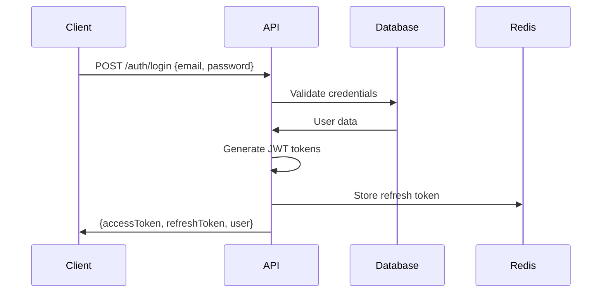
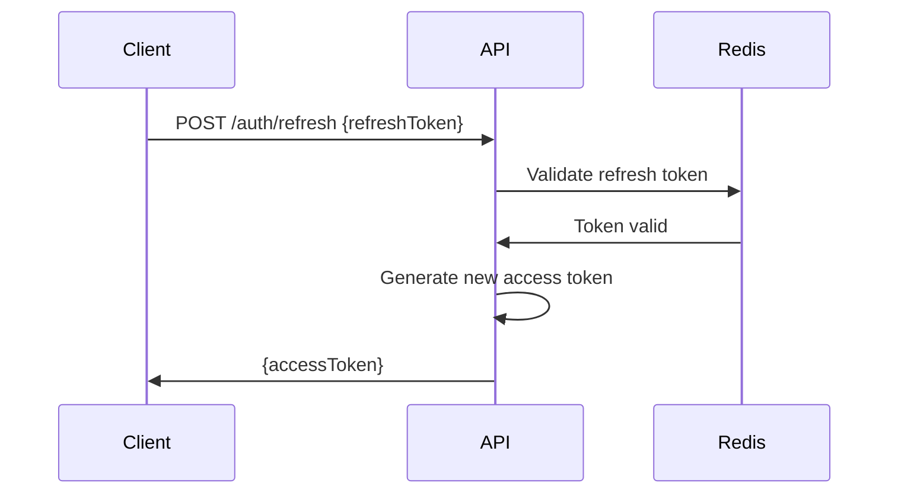
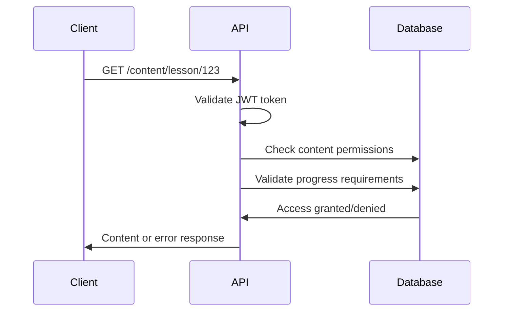

# JWT Authentication Strategy - Swarm Coordination Mastery Platform

## Overview
This document outlines the JWT-based authentication and authorization strategy for the learning platform, ensuring secure access to gated content and role-based permissions.

## JWT Token Structure

### Access Token
```javascript
{
  "header": {
    "alg": "HS256",
    "typ": "JWT"
  },
  "payload": {
    "sub": "user-uuid",
    "email": "user@example.com",
    "role": "student",
    "permissions": ["read:content", "write:progress"],
    "subscription": {
      "plan": "pro",
      "status": "active",
      "expiresAt": 1641234567
    },
    "iat": 1641234567,
    "exp": 1641234567,
    "iss": "swarm-learning-platform"
  }
}
```

### Refresh Token
```javascript
{
  "header": {
    "alg": "HS256",
    "typ": "JWT"
  },
  "payload": {
    "sub": "user-uuid",
    "type": "refresh",
    "jti": "refresh-token-id",
    "iat": 1641234567,
    "exp": 1641234567,
    "iss": "swarm-learning-platform"
  }
}
```

## Token Lifetimes
- **Access Token**: 15 minutes
- **Refresh Token**: 7 days
- **Password Reset Token**: 1 hour
- **Email Verification Token**: 24 hours

## Role-Based Access Control (RBAC)

### Role Definitions

#### Student Role
```javascript
{
  "role": "student",
  "permissions": [
    "read:own_profile",
    "update:own_profile",
    "read:enrolled_courses",
    "read:unlocked_content",
    "write:own_progress",
    "submit:assessments"
  ],
  "restrictions": {
    "content_access": "gated_by_progress",
    "rate_limits": {
      "api_calls": 100,
      "content_access": 50
    }
  }
}
```

#### Instructor Role
```javascript
{
  "role": "instructor",
  "permissions": [
    "read:own_profile",
    "update:own_profile",
    "read:all_courses",
    "create:courses",
    "update:own_courses",
    "read:student_progress",
    "create:assessments",
    "grade:submissions"
  ],
  "restrictions": {
    "content_access": "full",
    "rate_limits": {
      "api_calls": 500,
      "content_creation": 20
    }
  }
}
```

#### Admin Role
```javascript
{
  "role": "admin",
  "permissions": [
    "read:all_profiles",
    "update:all_profiles",
    "delete:users",
    "read:all_courses",
    "create:courses",
    "update:all_courses",
    "delete:courses",
    "read:all_progress",
    "manage:subscriptions",
    "view:analytics"
  ],
  "restrictions": {
    "content_access": "full",
    "rate_limits": {
      "api_calls": 1000
    }
  }
}
```

#### Enterprise Role
```javascript
{
  "role": "enterprise",
  "permissions": [
    "read:organization_profiles",
    "update:organization_profiles",
    "read:organization_courses",
    "assign:courses",
    "read:organization_progress",
    "create:teams",
    "manage:team_members",
    "view:organization_analytics"
  ],
  "restrictions": {
    "content_access": "organization_scope",
    "rate_limits": {
      "api_calls": 2000
    }
  }
}
```

## Authentication Flow

### 1. Login Process


### 2. Token Refresh Process


### 3. Content Access Validation


## Token Security

### Token Storage
- **Access Token**: Memory only (never localStorage)
- **Refresh Token**: Secure HTTP-only cookie
- **CSRF Protection**: Double-submit cookie pattern

### Token Validation Middleware
```javascript
const validateToken = (requiredPermissions = []) => {
  return async (req, res, next) => {
    try {
      const token = extractTokenFromHeader(req);
      const decoded = jwt.verify(token, process.env.JWT_SECRET);
      
      // Check token expiration
      if (decoded.exp < Date.now() / 1000) {
        return res.status(401).json({ error: 'Token expired' });
      }
      
      // Check permissions
      const hasPermission = requiredPermissions.every(permission => 
        decoded.permissions.includes(permission)
      );
      
      if (!hasPermission) {
        return res.status(403).json({ error: 'Insufficient permissions' });
      }
      
      req.user = decoded;
      next();
    } catch (error) {
      res.status(401).json({ error: 'Invalid token' });
    }
  };
};
```

## Content Gating Implementation

### Progressive Unlock Logic
```javascript
const checkContentAccess = async (userId, contentId) => {
  const user = await User.findById(userId);
  const content = await Content.findById(contentId);
  
  // Check subscription requirements
  if (content.requiresSubscription && !user.hasActiveSubscription()) {
    return { access: false, reason: 'subscription_required' };
  }
  
  // Check prerequisite completion
  if (content.prerequisites.length > 0) {
    const completedPrereqs = await Progress.findCompletedPrerequisites(
      userId, 
      content.prerequisites
    );
    
    if (completedPrereqs.length < content.prerequisites.length) {
      return { access: false, reason: 'prerequisites_not_met' };
    }
  }
  
  // Check level-based gating
  const levelAccess = await checkLevelAccess(userId, content.level);
  if (!levelAccess.hasAccess) {
    return { access: false, reason: 'level_locked' };
  }
  
  return { access: true };
};
```

### Level-Based Access Control
```javascript
const checkLevelAccess = async (userId, requestedLevel) => {
  const userProgress = await Progress.getUserProgress(userId);
  
  switch (requestedLevel) {
    case 'beginner':
      return { hasAccess: true };
      
    case 'intermediate':
      const beginnerCompletion = userProgress.beginner.completionRate;
      return {
        hasAccess: beginnerCompletion >= 0.8,
        requiredCompletion: 0.8,
        currentCompletion: beginnerCompletion
      };
      
    case 'advanced':
      const intermediateCompletion = userProgress.intermediate.completionRate;
      return {
        hasAccess: intermediateCompletion >= 0.8,
        requiredCompletion: 0.8,
        currentCompletion: intermediateCompletion
      };
      
    default:
      return { hasAccess: false };
  }
};
```

## Session Management

### Redis Session Storage
```javascript
const sessionStore = {
  async createSession(userId, refreshToken) {
    const sessionId = generateSessionId();
    const sessionData = {
      userId,
      refreshToken,
      createdAt: Date.now(),
      lastActivity: Date.now()
    };
    
    await redis.setex(
      `session:${sessionId}`,
      REFRESH_TOKEN_LIFETIME,
      JSON.stringify(sessionData)
    );
    
    return sessionId;
  },
  
  async validateSession(sessionId) {
    const sessionData = await redis.get(`session:${sessionId}`);
    if (!sessionData) return null;
    
    const session = JSON.parse(sessionData);
    
    // Update last activity
    session.lastActivity = Date.now();
    await redis.setex(
      `session:${sessionId}`,
      REFRESH_TOKEN_LIFETIME,
      JSON.stringify(session)
    );
    
    return session;
  },
  
  async deleteSession(sessionId) {
    await redis.del(`session:${sessionId}`);
  }
};
```

## API Rate Limiting

### Rate Limiting by Role
```javascript
const rateLimiter = {
  student: {
    windowMs: 15 * 60 * 1000, // 15 minutes
    max: 100, // requests per window
    skipSuccessfulRequests: false
  },
  instructor: {
    windowMs: 15 * 60 * 1000,
    max: 500,
    skipSuccessfulRequests: false
  },
  admin: {
    windowMs: 15 * 60 * 1000,
    max: 1000,
    skipSuccessfulRequests: false
  },
  enterprise: {
    windowMs: 15 * 60 * 1000,
    max: 2000,
    skipSuccessfulRequests: false
  }
};
```

## Security Best Practices

### Password Security
- **Bcrypt**: Minimum 12 rounds for hashing
- **Password Policy**: 8+ characters, mixed case, numbers, symbols
- **Password History**: Prevent reuse of last 5 passwords
- **Account Lockout**: 5 failed attempts, 15-minute lockout

### Token Security
- **Secret Rotation**: JWT secrets rotated monthly
- **Token Blacklisting**: Revoked tokens stored in Redis
- **Secure Headers**: CORS, CSP, HSTS implementation
- **Input Validation**: All inputs sanitized and validated

### Audit Logging
```javascript
const auditLogger = {
  logAuthentication(userId, action, success, metadata) {
    const logEntry = {
      userId,
      action, // 'login', 'logout', 'refresh', 'failed_login'
      success,
      timestamp: Date.now(),
      ip: metadata.ip,
      userAgent: metadata.userAgent,
      sessionId: metadata.sessionId
    };
    
    // Log to database and external service
    AuditLog.create(logEntry);
    securityLogger.info(logEntry);
  }
};
```

## Error Handling

### Authentication Errors
```javascript
const authErrors = {
  INVALID_CREDENTIALS: {
    code: 'AUTH_001',
    message: 'Invalid email or password',
    httpStatus: 401
  },
  TOKEN_EXPIRED: {
    code: 'AUTH_002',
    message: 'Token has expired',
    httpStatus: 401
  },
  INSUFFICIENT_PERMISSIONS: {
    code: 'AUTH_003',
    message: 'Insufficient permissions for this action',
    httpStatus: 403
  },
  ACCOUNT_LOCKED: {
    code: 'AUTH_004',
    message: 'Account temporarily locked due to failed attempts',
    httpStatus: 423
  },
  SUBSCRIPTION_REQUIRED: {
    code: 'AUTH_005',
    message: 'Premium subscription required',
    httpStatus: 402
  }
};
```

## Testing Strategy

### Unit Tests
- Token generation and validation
- Permission checking logic
- Rate limiting functionality
- Password hashing and validation

### Integration Tests
- Complete authentication flow
- Content access validation
- Session management
- Role-based access control

### Security Tests
- Token manipulation attempts
- Permission escalation tests
- Rate limiting bypass attempts
- Session hijacking prevention

This JWT authentication strategy provides robust security while maintaining usability and scalability for the Swarm Coordination Mastery platform.